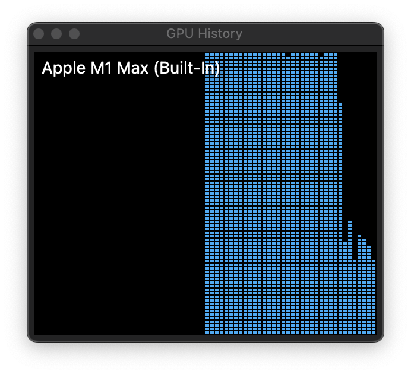

# ml-playground

## prerequisites

### conda

```sh
brew install --cask miniconda
conda init fish
```

```sh
conda create -n ml-playground python=3.9
conda activate ml-playground
```

### tensorflow

```sh
conda install -c apple tensorflow-deps
```



### [pdm](https://pdm.fming.dev/latest/)

```sh
pdm install
```

## notebooks

activate the env

```sh
conda activate ml-playground
```

open the jupyter lab

```sh
jupyter lab
```

## ref

- [Get started with tensorflow-metal](https://developer.apple.com/metal/tensorflow-plugin/)
