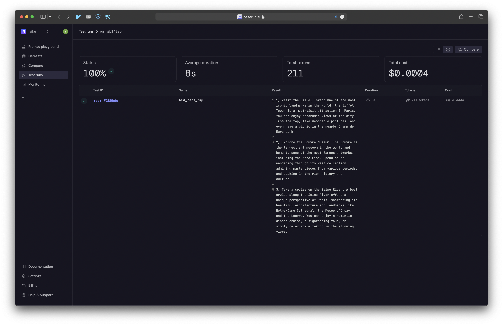

# [baserun](https://github.com/baserun-ai/baserun-py)

## quickstart

### setup

```sh
export BASERUN_API_KEY=''
```

### testing

```sh
pdm run pytest --baserun baserun/test_module.py
```



### tracking

TODO
